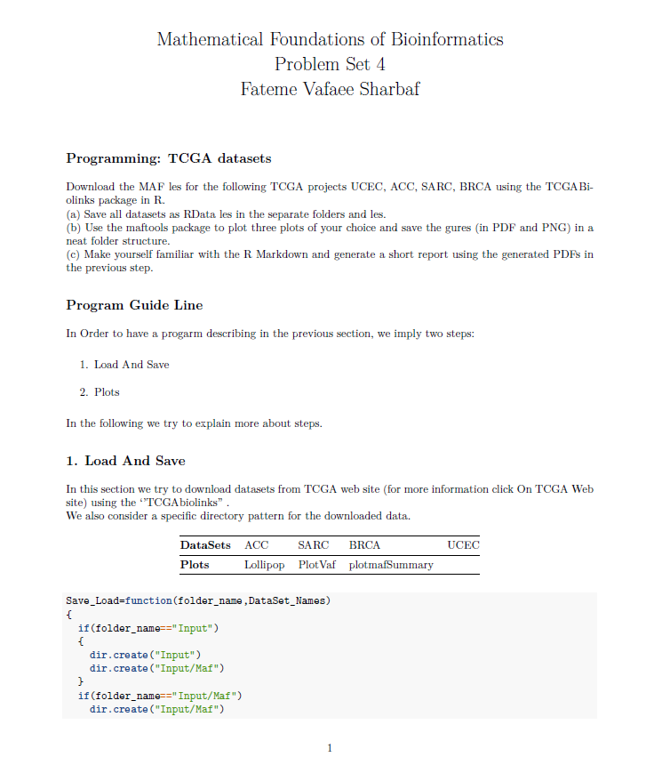

# generating-a-short-report-using-R-Markdown
<!-- Improved compatibility of back to top link: See: https://github.com/othneildrew/Best-README-Template/pull/73 -->
<a name="readme-top"></a>


<!-- PROJECT LOGO -->
<br />
<div align="center">

<h3 align="center">TCGA-MAF-Downloader-Analyzer(Vaf Plot, mafSummary Plot, Lollipop Plot) </h3>

  <p align="center">
    Department of Bioinformatics, IBB, University of Tehran
    <br />
  </p>
</div>


<div align="center">
  
</div>

<!-- TABLE OF CONTENTS -->
<details>
  <summary>Table of Contents</summary>
  <ol>
    <li>
      <a href="#Description">Description</a>
    </li>
    <li><a href="#R_Markdown_Structure">R Markdown Structure</a></li>
    <li><a href="#Code_Functionality">Code Functionality</a></li>
    <li><a href="#Languages_Used">Languages Used</a></li>
    <li><a href="#Additional_Points">Additional Points</a></li>
    <li>
      <a href="#Customization">Customization</a>
    </li>
    <li><a href="#Contact">Contact</a></li>
  </ol>
</details>


<!-- ABOUT THE PROJECT -->
### Description
The code defines the functions for data download/saving and plot generation.<br>
You can modify the project names in the Save_Load function.<br>
Running the code downloads data, generates plots, and saves them in a structured folder hierarchy.<br>
The markdown text provides context and explanation for each step.


<h2 id="R_Markdown_Structure" >R Markdown Structure</h2>
The code consists of three main parts:
<ol>
  <li>YAML header: This section starts with --- and defines document properties like title, output format (here, PDF document using output: pdf_document).</li>
  <li>Markdown text: This section contains human-readable text with formatting options for headings, paragraphs, etc. It describes the purpose of the code and outlines the steps involved.
</li>
  <li>R code chunks: These sections are delineated by lines of three backticks (````{r}`). They contain R code that gets executed and the output is incorporated into the final document. Comments within the code chunks explain their functionality.
</li>
</ol>

<h2 id="Code_Functionality"> Code Functionality</h2>

The R code is divided into two main functions:

## Save_Load function
<ul>
  <li>Takes arguments for folder names and dataset names.</li>
  <li>Creates separate folders for each dataset (if they don't exist).</li>
  <li>Downloads MAF files from TCGA for specified projects using GDCquery_Maf from the TCGAbiolinks package.</li>
  <li>Saves the downloaded data as RData files in the designated folders using save.</li>
</ul>


## Plots function
<ul>
  <li>Takes arguments for the directory containing the downloaded datasets and their names.</li>
  <li>Loads each dataset using read.maf from the maftools package.</li>
  <li>Loads each dataset using read.maf from the maftools package.</li>
  <li>Creates a folder structure for each dataset's output (if it doesn't exist).</li>
  <li>Generates three plots for each dataset:</li>
  <ul>
    <li>Lollipop plot using lollipopPlot (custom gene, mutation type, and reference sequence ID are specified).</li>
    <li>PlotVaf plot (Tumor Mutation Burden) using titv and plotTiTv (adjusted for synonymous mutations).</li>
    <li>plotmafSummary plot using plotmafSummary (including median mutation rate).</li>
  </ul>
  <li>Saves each plot as a PNG and PDF file using png and pdf functions, specifying width and height for better visualization.</li>
</ul>


<h2 id="Languages_Used"> Languages Used</h2>

R Packages 
<p align="right">(<a href="#readme-top">back to top</a>)</p>


<!-- GETTING STARTED -->
<h2 id="Additional_Points"> Additional Points</h2>
<ul>
  <li>The code demonstrates how to integrate R code execution with a human-readable report using R markdown.</li>
  <li>Error handling and more advanced functionalities can be incorporated to enhance the code's robustness.</li>
  <li>I hope this explanation clarifies the structure and functionality of the R markdown code itself.</li>
</ul>

### Customization:

## Customizing Data Download (Save_Load function):

<strong>Project Names:</strong> Update the DataSet_Names vector in the Save_Load function to include the desired TCGA project names you want to download data for.<bt>
<strong>Folder Structure:</strong> Modify the folder creation logic within Save_Load to create a more customized folder structure for downloaded data (e.g., by project type, data type).

## Customizing Plots (Plots function):

<strong>Plot Types: </strong>The code currently generates three plots (Lollipop, PlotVaf, plotmafSummary). You can remove or add different plots provided by the maftools package (e.g., mutation spectrum plots, waterfall plots).<br>
<strong>Plot Customization:</strong> Within each plot generation section (lollipopPlot, plotTiTv, plotmafSummary), you can modify function arguments to customize plot appearance:<br>
Change titles, labels, colors using arguments like main, xlab, ylab, col.<br>
Adjust plot ranges using arguments like xlim, ylim.<br>
<strong>Advanced Analysis:</strong> Explore functions within maftools for more in-depth analysis before plotting (e.g., filtering mutations, selecting specific genes).


### Customizing the Report:

<strong>Markdown Text:</strong> Modify the markdown text sections to provide more specific information about the datasets, plots, or analysis goals.<br>
<strong>Adding Images:</strong> You can include additional images (not generated by the code) in the markdown text to enhance the report.<br>
<strong>Report Formatting:</strong> Utilize markdown formatting options (bold, italics, headers) to structure and improve readability of the report.<br>

By following these customization suggestions, users can tailor the R markdown code to their specific TCGA data analysis requirements and generate informative reports.

Feel free to tailor the title and description based on the specific features and focus of your tool.
<p align="right">(<a href="#readme-top">back to top</a>)</p>


<!-- CONTACT -->
## Contact

vafaeeshaarbaf@gmail.com


<p align="right">(<a href="#readme-top">back to top</a>)</p>


<!-- ACKNOWLEDGMENTS -->
## Acknowledgments

Department of Bioinformatics, IBB, University of Tehran

<p align="right">(<a href="#readme-top">back to top</a>)</p>


<!-- MARKDOWN LINKS & IMAGES -->
<!-- https://www.markdownguide.org/basic-syntax/#reference-style-links -->
[contributors-shield]: https://img.shields.io/github/contributors/github_username/repo_name.svg?style=for-the-badge
[contributors-url]: https://github.com/github_username/repo_name/graphs/contributors
[forks-shield]: https://img.shields.io/github/forks/github_username/repo_name.svg?style=for-the-badge
[forks-url]: https://github.com/github_username/repo_name/network/members
[stars-shield]: https://img.shields.io/github/stars/github_username/repo_name.svg?style=for-the-badge
[stars-url]: https://github.com/github_username/repo_name/stargazers
[issues-shield]: https://img.shields.io/github/issues/github_username/repo_name.svg?style=for-the-badge
[issues-url]: https://github.com/github_username/repo_name/issues
[license-shield]: https://img.shields.io/github/license/github_username/repo_name.svg?style=for-the-badge
[license-url]: https://github.com/github_username/repo_name/blob/master/LICENSE.txt
[linkedin-shield]: https://img.shields.io/badge/-LinkedIn-black.svg?style=for-the-badge&logo=linkedin&colorB=555
[linkedin-url]: https://linkedin.com/in/linkedin_username
[product-screenshot]: images/screenshot.png
[Next.js]: https://img.shields.io/badge/next.js-000000?style=for-the-badge&logo=nextdotjs&logoColor=white
[Next-url]: https://nextjs.org/
[React.js]: https://img.shields.io/badge/React-20232A?style=for-the-badge&logo=react&logoColor=61DAFB
[React-url]: https://reactjs.org/
[Vue.js]: https://img.shields.io/badge/Vue.js-35495E?style=for-the-badge&logo=vuedotjs&logoColor=4FC08D
[Vue-url]: https://vuejs.org/
[Angular.io]: https://img.shields.io/badge/Angular-DD0031?style=for-the-badge&logo=angular&logoColor=white
[Angular-url]: https://angular.io/
[Svelte.dev]: https://img.shields.io/badge/Svelte-4A4A55?style=for-the-badge&logo=svelte&logoColor=FF3E00
[Svelte-url]: https://svelte.dev/
[Laravel.com]: https://img.shields.io/badge/Laravel-FF2D20?style=for-the-badge&logo=laravel&logoColor=white
[Laravel-url]: https://laravel.com
[Bootstrap.com]: https://img.shields.io/badge/Bootstrap-563D7C?style=for-the-badge&logo=bootstrap&logoColor=white
[Bootstrap-url]: https://getbootstrap.com
[JQuery.com]: https://img.shields.io/badge/jQuery-0769AD?style=for-the-badge&logo=jquery&logoColor=white
[JQuery-url]: https://jquery.com
